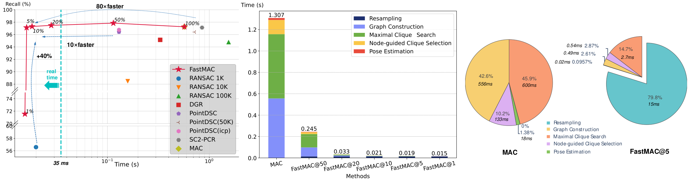

# FastMAC: Stochastic Spectral Sampling of Correspondence Graph
Source code of [FastMAC: Stochastic Spectral Sampling of Correspondence Graph]()

## Introduction
3D correspondence, i.e., a pair of 3D points, is a fundamental concept in computer vision. A set of 3D correspondences, when equipped with compatibility edges, forms a correspondence graph. This graph is a critical component in several state-of-the-art 3D point cloud registration approaches, e.g., the one based on maximal cliques (MAC). However, its properties have not been well understood. So we present the first study that introduces graph signal processing into the domain of correspondence graph. We exploit the generalized degree signal on correspondence graph and pursue sampling strategies that preserve high-frequency components of this signal. To address time-consuming singular value decomposition in deterministic sampling, we resort to a stochastic approximate sampling strategy. As such, the core of our method is the stochastic spectral sampling of correspondence graph. As an application, we build a complete 3D registration algorithm termed as FastMAC, that reaches real-time speed while leading to little to none performance drop. Through extensive experiments, we validate that FastMAC works for both indoor and outdoor benchmarks. For example, FastMAC can accelerate MAC by 80 times while maintaining high registration success rate on KITTI. 

## News
- [2023/12/4] Code is released.

## Installation
Please install [PyTorch](https://pytorch.org/) first, and then install other dependencies by the following command. Code has been tested with Python 3.8.10, PyTorch 1.12.0, CUDA 11.3 and cuDNN 8302 on Ubuntu 22.04.
```
pip install -r requirements.txt
```
Finally, install [MAC(3D Registration with Maximal Cliques)](https://github.com/zhangxy0517/3D-Registration-with-Maximal-Cliques/tree/main) as instructed.

## Datasets
The test datasets include KITTI, 3DMatch, 3DLoMatch. Please download them from [MAC(3D Registration with Maximal Cliques)](https://github.com/zhangxy0517/3D-Registration-with-Maximal-Cliques/tree/main).

## Usage
To demonstrate the reliability of our method's boosting performance for MAC, we use the original MAC as the registration module. Therefore, to run the complete pipeline, use the code we present here to downsample the input correspondences and then feed them into MAC, using the code in [MAC repository](https://github.com/zhangxy0517/3D-Registration-with-Maximal-Cliques/tree/main). In the future we would integrate the two parts into one codebase 
to form a complete pipeline for 
practical usage.

## KITTI
To run FastMAC on KITTI, please use the following command:
```
python sota.py
```
In function Config(), modify "data_dir", "filename", "gtname", "labelname" and "outpath" as the actual path you set. "ratio" refers to the
downsampling ratio from 0 to 1.

**NOTE: set 'thresh' to 0.999 if using FCGF descriptor, 0.9 if using FPFH descriptor.**

## 3DMatch
To run FastMAC on 3DMatch, please use the following command:
```
python 3dmatch.py
```
In function Config(), modify "data_dir", "descriptor" as the actual path you set. The output path will be the original dataset direction for convenience to apply MAC. "ratio" refers to the
downsampling ratio from 0 to 1. Set "name" to "3dmatch" to run on 3DMatch.

## 3DLoMatch
To run FastMAC on 3DMatch, please use the following command:
```
python 3dmatch.py
```
In function Config(), modify "data_dir", "descriptor" as the actual path you set. The output path will be the original dataset direction for convenience to apply MAC. "ratio" refers to the
downsampling ratio from 0 to 1. Set "name" to "3dlomatch" to run on 3DLoMatch.

## Results

### KITTI

| Descriptor | Ratio(%) | RR     | RE(°)    | TE(cm)  |
|:----------:|:--------:|:------:|:--------:|:-------:|
| FPFH       | 100      | 97.66% | 0.405772 | 8.61193 |
| FPFH       | 50       | 97.84% | 0.410393 | 8.61099 |
| FPFH       | 20       | 97.84% | 0.415011 | 8.64669 |
| FPFH       | 10       | 98.02% | 0.447299 | 9.06907 |
| FPFH       | 5        | 97.12% | 0.491153 | 9.64376 |
| FPFH       | 1        | 94.05% | 0.831317 | 13.5936 |

| Descriptor | Ratio(%) | RR     | RE(°)    | TE(cm)  |
|:----------:|:--------:|:------:|:--------:|:-------:|
| FCGF       | 100      | 97.12% | 0.355121 | 7.99152 |
| FCGF       | 50       | 97.48% | 0.368148 | 8.0161  |
| FCGF       | 20       | 97.30% | 0.391029 | 8.45734 |
| FCGF       | 10       | 96.94% | 0.445949 | 9.20145 |
| FCGF       | 5        | 96.04% | 0.525363 | 10.0375 |
| FCGF       | 1        | 71.89% | 0.996978 | 14.8993 |

### 3DMatch

| Descriptor | Ratio(%) | RR     | RE(°)   | TE(cm)  |
|:----------:|:--------:|:------:|:-------:|:-------:|
| FPFH       | 100      | 83.86% | 2.10952 | 6.79597 |
| FPFH       | 50       | 82.87% | 2.15102 | 6.73052 |
| FPFH       | 20       | 80.71% | 2.17369 | 6.80735 |
| FPFH       | 10       | 78.87% | 2.28292 | 7.05551 |
| FPFH       | 5        | 74.49% | 2.2949  | 6.97654 |
| FPFH       | 1        | 58.04% | 2.44924 | 7.28792 |


| Descriptor | Ratio(%) | RR     | RE(°)   | TE(cm)  |
|:----------:|:--------:|:------:|:-------:|:-------:|
| FCGF       | 100      | 93.72% | 2.02746 | 6.53953 |
| FCGF       | 50       | 92.67% | 1.99611 | 6.46513 |
| FCGF       | 20       | 92.30% | 2.0205  | 6.51827 |
| FCGF       | 10       | 90.94% | 2.02694 | 6.52478 |
| FCGF       | 5        | 89.40% | 2.06517 | 6.75127 |
| FCGF       | 1        | 58.23% | 2.16245 | 7.10037 |

### 3DLoMatch

| Descriptor | Ratio(%) | RR     | RE(°)   | TE(cm)  |
|:----------:|:--------:|:------:|:-------:|:-------:|
| FPFH       | 100      | 41.21% | 4.05137 | 10.6133 |
| FPFH       | 50       | 38.46% | 4.03769 | 10.4745 |
| FPFH       | 20       | 34.31% | 4.11826 | 10.8244 |
| FPFH       | 10       | 31.56% | 4.35467 | 11.3328 |
| FPFH       | 5        | 27.40% | 4.44883 | 11.3483 |
| FPFH       | 1        | 12.24% | 4.39649 | 12.5056 |

| Descriptor | Ratio(%) | RR     | RE(°)   | TE(cm)  |
|:----------:|:--------:|:------:|:-------:|:-------:|
| FCGF       | 100      | 60.19% | 3.75996 | 10.6147 |
| FCGF       | 50       | 58.23% | 3.80416 | 10.8137 |
| FCGF       | 20       | 55.25% | 3.83575 | 10.7118 |
| FCGF       | 10       | 54.35% | 3.94558 | 10.9791 |
| FCGF       | 5        | 51.49% | 4.07549 | 11.0795 |
| FCGF       | 1        | 37.06% | 4.4706  | 12.1996 |
